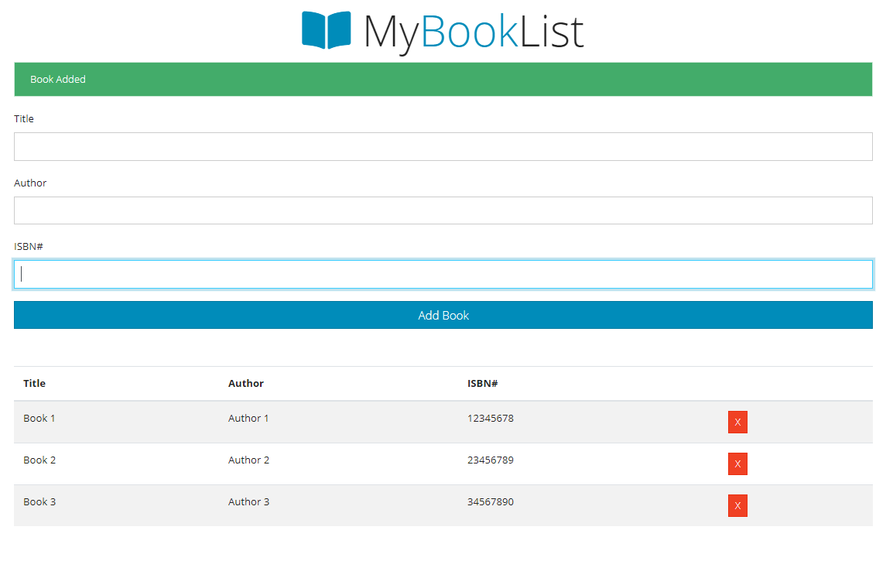

# book-list

A book list app created for practices. Uses vanilla Javascript, built in a OOP fashion with local storage.

Created by following [Traversy Media\'s tutorial](https://www.youtube.com/watch?v=JaMCxVWtW58&list=PLillGF-RfqbbnEGy3ROiLWk7JMCuSyQtX&index=6) on Youtube
